# xsukax Flowchart Maker


A professional, privacy-focused, client-side flowchart creation tool that enables users to design, customize, and export high-quality flowcharts without writing a single line of code.

## 📋 Table of Contents

- [Project Overview](#-project-overview)
- [Security and Privacy Benefits](#-security-and-privacy-benefits)
- [Features and Advantages](#-features-and-advantages)
- [Installation Instructions](#-installation-instructions)
- [Usage Guide](#-usage-guide)
- [Technical Architecture](#-technical-architecture)
- [Browser Compatibility](#-browser-compatibility)
- [Contributing](#-contributing)
- [License](#-license)

## 🎯 Project Overview

**xsukax Flowchart Maker** is a sophisticated, single-page web application designed to democratize flowchart creation by providing an intuitive visual interface for building professional diagrams. Built entirely with modern web technologies, this tool leverages Mermaid.js for rendering, Bootstrap 5 for responsive design, and operates completely client-side—ensuring maximum privacy and zero server dependencies.

The application caters to developers, project managers, educators, business analysts, and anyone requiring clear visual representations of processes, workflows, or system architectures. By eliminating the need for coding knowledge or complex software installations, xsukax Flowchart Maker empowers users to focus on content rather than syntax.

### Key Capabilities

- **Visual Flowchart Builder**: Create complex flowcharts using an intuitive point-and-click interface
- **Real-Time Preview**: See changes instantly as you edit nodes and connections
- **Multiple Export Formats**: Download flowcharts as high-resolution PNG, scalable SVG, or Mermaid markdown
- **Comprehensive Node Shapes**: Support for 11 different node shapes including rectangles, diamonds, circles, and more
- **Custom Styling**: Full control over node colors, text colors, and connection types
- **Zero Installation**: Runs directly in any modern web browser
- **Privacy-First Design**: All processing happens locally in your browser

## 🔒 Security and Privacy Benefits

xsukax Flowchart Maker is architected with a privacy-first philosophy, ensuring that user data remains exclusively under user control:

### 1. **Complete Client-Side Operation**
All flowchart creation, editing, and rendering operations execute entirely within the user's browser. No data is transmitted to external servers, eliminating risks associated with data interception, unauthorized access, or third-party data collection.

### 2. **No Data Persistence Mechanisms**
The application deliberately avoids using browser storage APIs (localStorage, sessionStorage, or IndexedDB). This design decision ensures that:
- No flowchart data persists after closing the browser tab
- No residual data remains on the device
- Users maintain complete control over their work products
- Compliance with strict data privacy regulations is inherent

### 3. **Zero External Dependencies for Runtime**
While the application loads libraries from trusted CDNs (Bootstrap, Mermaid.js, Bootstrap Icons), all user data processing occurs locally. CDN resources are used solely for rendering the interface and generating visualizations—they never access or transmit user-created content.

### 4. **No Authentication or Tracking**
The application requires no user accounts, login credentials, or personal information. No analytics, telemetry, or tracking mechanisms are embedded in the codebase, ensuring anonymous usage.

### 5. **Transparent Source Code**
As an open-source project licensed under GPL-3.0, the entire application codebase is publicly auditable. Users and security researchers can verify the absence of data collection mechanisms or security vulnerabilities.

### 6. **Export Control**
All export operations (PNG, SVG, Markdown) are handled via local browser APIs using client-side blob generation and download mechanisms. Exported files are created entirely on the user's device without any cloud intermediation.

## ✨ Features and Advantages

### Core Features

#### 🎨 **Intuitive Visual Interface**
- GitHub-inspired clean design with professional aesthetics
- Split-panel layout: configuration on the left, live preview on the right
- Responsive design that adapts to desktop, tablet, and mobile devices
- Toast notifications for user feedback (no disruptive alert popups)

#### 📊 **Comprehensive Node Support**
Support for 11 Mermaid-compatible node shapes:
- **Rectangle**: Standard process boxes
- **Rounded Rectangle**: Soft-edged processes
- **Stadium**: Pill-shaped start/end nodes
- **Subroutine**: Process with side indicators
- **Cylindrical**: Database representations
- **Circle**: Simple circular nodes
- **Asymmetric**: Flag-shaped indicators
- **Rhombus**: Decision diamonds
- **Hexagon**: Preparation steps
- **Parallelogram**: Input/output operations
- **Trapezoid**: Manual operations

#### 🔗 **Flexible Connection Types**
Five distinct connection styles:
- **Solid Arrow** (→): Standard directional flow
- **Dotted Arrow** (⋯→): Alternate or conditional paths
- **Thick Arrow** (⇒): Emphasized connections
- **Open Link** (—): Non-directional associations
- **Dotted Open Link** (⋯): Weak associations

#### 🎨 **Advanced Customization**
- HTML5 color pickers for node background colors
- Independent text color selection for optimal contrast
- Optional connection labels for annotated workflows
- Configurable flowchart direction (TB, BT, LR, RL)

#### 💾 **Multi-Format Export**
- **PNG Export**: High-resolution (3× scale) raster images with transparent backgrounds
- **SVG Export**: Infinitely scalable vector graphics preserving all visual fidelity
- **Markdown Export**: Complete Mermaid code with styling directives for documentation integration

#### ⚡ **Performance Optimizations**
- Debounced rendering (300ms delay) prevents excessive re-renders during rapid editing
- Efficient DOM manipulation for color application
- Lazy rendering updates only when necessary

### Competitive Advantages

| Feature | xsukax Flowchart Maker | Traditional Tools |
|---------|------------------------|-------------------|
| **Installation Required** | ❌ No | ✅ Yes |
| **Internet Connection** | CDN only (optional offline with CDN cache) | Often required |
| **Data Privacy** | 🔒 100% local | ⚠️ Cloud-stored |
| **Learning Curve** | 📈 Minimal (visual interface) | 📚 Steep (syntax/UI complexity) |
| **Export Formats** | PNG, SVG, Markdown | Varies |
| **Cost** | 💯 Free & Open Source | Often paid |
| **Cross-Platform** | ✅ Any browser | Platform-dependent |
| **Version Control Friendly** | ✅ (Markdown export) | ⚠️ Binary formats |

## 📦 Installation Instructions

### Standard Installation

xsukax Flowchart Maker requires no traditional installation. Follow these steps to get started:

#### Method 1: Direct Browser Access (Recommended)

1. **Download the Application**
   ```bash
   # Clone the repository
   git clone https://github.com/xsukax/xsukax-Flowchart-Maker.git
   
   # Navigate to the directory
   cd xsukax-Flowchart-Maker
   ```

2. **Open in Browser**
   - Simply double-click `index.html`, or
   - Right-click `index.html` → "Open with" → Select your preferred browser

3. **Start Creating**
   - The application loads with a sample flowchart demonstrating capabilities
   - Begin editing immediately or start from scratch

#### Method 2: Local Web Server (Optional)

For developers preferring a local server environment:

```bash
# Using Python 3
python -m http.server 8000

# Using Node.js http-server
npx http-server -p 8000

# Using PHP
php -S localhost:8000
```

Then navigate to `http://localhost:8000/index.html`

#### Method 3: GitHub Pages Deployment

Host your own instance:

1. Fork the repository on GitHub
2. Enable GitHub Pages in repository settings
3. Access via `https://yourusername.github.io/xsukax-Flowchart-Maker/`

### System Requirements

- **Operating System**: Windows, macOS, Linux, iOS, Android, or any OS supporting modern web browsers
- **Web Browser**: Chrome 90+, Firefox 88+, Safari 14+, Edge 90+, or equivalent
- **Internet Connection**: Required for initial CDN resource loading (Bootstrap, Mermaid.js, Bootstrap Icons)
- **Storage**: < 1 MB for the HTML file
- **Memory**: Minimal (standard browser requirements)

### Offline Usage Considerations

While the application works primarily client-side, it loads three CDN resources:
- Bootstrap 5.3.2 CSS & JS
- Mermaid.js 11.12.0
- Bootstrap Icons 1.11.1

For complete offline functionality:
1. Download CDN resources locally
2. Modify `<link>` and `<script>` tags to reference local files
3. Save modified `index.html`

## 📖 Usage Guide

### Getting Started

#### 1. Initial Interface Overview

Upon opening the application, you'll see:


#### 2. Creating Your First Flowchart

**Step-by-Step Workflow:**

1. **Set Chart Metadata**
   - Enter a descriptive title in the "Chart Title" field
   - Select flowchart direction (Top to Bottom, Left to Right, etc.)

2. **Add Nodes**
   - Click the "+ Add" button in the Nodes section
   - Configure each node:
     - **Background Color**: Click the left color picker (labeled "BG")
     - **Text Color**: Click the right color picker (labeled "Text")
     - **Shape**: Select from the dropdown (Rectangle, Diamond, etc.)
     - **Label**: Enter descriptive text in the input field

3. **Create Connections**
   - Click the "+ Add" button in the Connections section (enabled after adding 2+ nodes)
   - For each connection:
     - **From**: Select the source node
     - **To**: Select the destination node
     - **Type**: Choose arrow style (Solid, Dotted, Thick, etc.)
     - **Label**: Optionally add descriptive text

4. **Preview in Real-Time**
   - The right panel updates automatically as you edit
   - Changes appear within 300ms (debounced)

5. **Export Your Work**
   - Click **PNG** for high-resolution raster images
   - Click **SVG** for scalable vector graphics
   - Click **MD** for Mermaid markdown code

### Common Workflows

#### Workflow 1: Simple Process Flow


**Steps to Create:**
1. Add 5 nodes: Start (Stadium), Input (Rectangle), Process (Rectangle), Review (Rhombus), End (Stadium)
2. Add 5 connections following the flow above
3. Add labels "Yes" and "No" to decision branches

#### Workflow 2: System Architecture Diagram


**Steps to Create:**
1. Change direction to "Left to Right (LR)"
2. Use Circle shape for User
3. Use Cylindrical shape for Database
4. Use Rectangle shapes for services
5. Create connections to show data flow

### Advanced Techniques

#### Customizing Colors for Emphasis

Use color psychology to enhance understanding:
- **Green** (#4CAF50): Start/success states
- **Red** (#F44336): End/error states
- **Blue** (#2196F3): Process steps
- **Orange** (#FF9800): Decision points
- **Gray** (#9E9E9E): Optional/inactive paths

#### Creating Decision Trees


Use Rhombus shapes for all decision points and ensure clear yes/no labels on connections.

#### Organizing Complex Flowcharts

For large diagrams:
1. Group related nodes with similar colors
2. Use consistent shapes for similar functions
3. Minimize crossing connections by adjusting node order
4. Use dotted connections for secondary/optional flows

### Keyboard Shortcuts and Tips

- **Tab**: Navigate between form fields
- **Enter**: Submit form inputs (triggers preview update)
- **Delete Node**: Automatically removes connected edges
- **Minimum Nodes**: System enforces minimum of 2 nodes
- **Connection Validation**: Cannot connect a node to itself

### Troubleshooting

| Issue | Solution |
|-------|----------|
| Preview not updating | Check browser console for errors; refresh page |
| Export button disabled | Ensure flowchart has rendered successfully |
| Color not applying | Verify hex color format; ensure contrast for visibility |
| Connection not showing | Verify both nodes exist; check connection type selection |
| PNG export cropped | Issue resolved in latest version; ensure you have updated code |

## 🏗️ Technical Architecture

### Technology Stack


### Application State Management

The application maintains state through JavaScript objects:

```javascript
// Core state structure
{
  nodes: [
    { id: 'node1', label: 'Start', shape: 'stadium', color: '#4CAF50', textColor: '#ffffff' }
  ],
  connections: [
    { from: 'node1', to: 'node2', type: 'solid', label: 'Next' }
  ]
}
```

### Rendering Pipeline


### Export Process Flow


### Security Considerations

```mermaid
flowchart TB
    Input[User Input] --> Validation[Input Validation]
    Validation --> Local[Local Processing Only]
    Local --> Render[Client-Side Rendering]
    Render --> Export[Local File Export]
    
    Local -.No Network Calls.-> Cloud[❌ Cloud Services]
    Local -.No Storage.-> Storage[❌ Browser Storage]
    Local -.No Tracking.-> Analytics[❌ Analytics]
    
    style Cloud fill:#ffcccc
    style Storage fill:#ffcccc
    style Analytics fill:#ffcccc
```



## 🌐 Browser Compatibility

| Browser | Minimum Version | Tested | Notes |
|---------|----------------|--------|-------|
| Google Chrome | 90+ | ✅ v120 | Recommended |
| Mozilla Firefox | 88+ | ✅ v121 | Fully supported |
| Safari | 14+ | ✅ v17 | macOS/iOS |
| Microsoft Edge | 90+ | ✅ v120 | Chromium-based |
| Opera | 76+ | ✅ v106 | Chromium-based |
| Samsung Internet | 14+ | ⚠️ | Limited testing |

### Feature Support Requirements

- **ES6+ JavaScript**: Template literals, arrow functions, async/await
- **HTML5 Canvas API**: For PNG export functionality
- **Blob API**: For file download generation
- **SVG Support**: For rendering and export
- **CSS3**: Flexbox, Grid (via Bootstrap)

## 🤝 Contributing

Contributions are welcome! Here's how you can help improve xsukax Flowchart Maker:

### Ways to Contribute

1. **Report Bugs**: Open an issue with detailed reproduction steps
2. **Suggest Features**: Propose enhancements via GitHub issues
3. **Submit Pull Requests**: Fork, develop, and submit PRs
4. **Improve Documentation**: Enhance README or add tutorials
5. **Create Examples**: Share interesting flowchart use cases

### Development Guidelines

```bash
# Fork and clone the repository
git clone https://github.com/yourusername/xsukax-Flowchart-Maker.git

# Create a feature branch
git checkout -b feature/your-feature-name

# Make your changes to index.html

# Test thoroughly in multiple browsers

# Commit with descriptive messages
git commit -m "Add: Description of your changes"

# Push to your fork
git push origin feature/your-feature-name

# Open a Pull Request on GitHub
```

### Code Style Guidelines

- Maintain single-file architecture (all code in `index.html`)
- Follow existing JavaScript formatting conventions
- Write single-line CSS rules for consistency
- Add comments for complex logic
- Ensure cross-browser compatibility
- Test export functionality thoroughly

### Testing Checklist

- [ ] Application loads without console errors
- [ ] All node shapes render correctly
- [ ] All connection types display properly
- [ ] Color pickers function as expected
- [ ] Real-time preview updates smoothly
- [ ] PNG export captures entire flowchart
- [ ] SVG export maintains quality
- [ ] Markdown export includes all styling
- [ ] Responsive design works on mobile
- [ ] Toast notifications appear correctly

## 📄 License

This project is licensed under the GNU General Public License v3.0.

---

<div align="center">

**Made with ❤️ by the open-source community**

[Report Bug](https://github.com/xsukax/xsukax-Flowchart-Maker/issues) · [Request Feature](https://github.com/xsukax/xsukax-Flowchart-Maker/issues) · [GitHub Repository](https://github.com/xsukax/xsukax-Flowchart-Maker)

⭐ **Star this repository if you find it helpful!**

</div>
